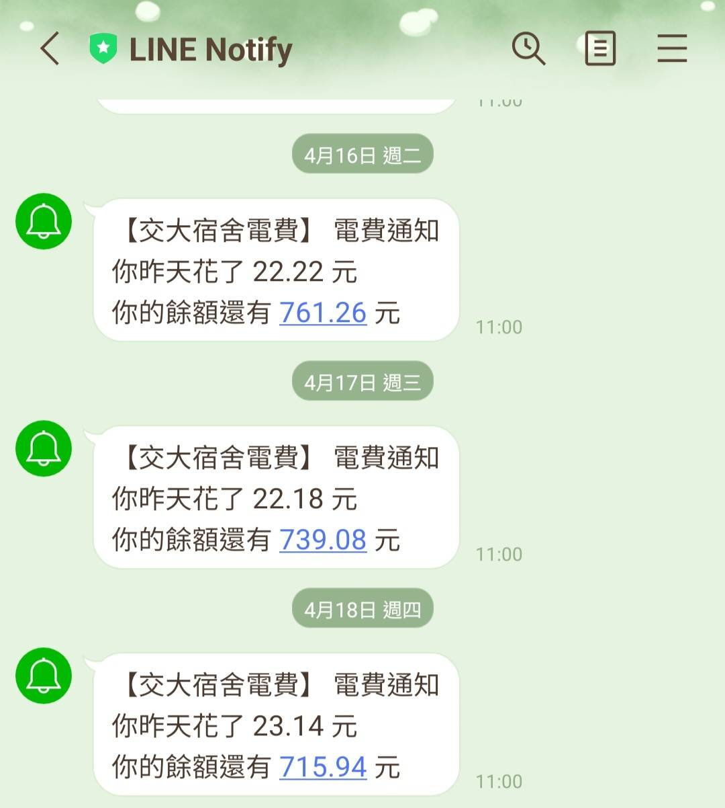
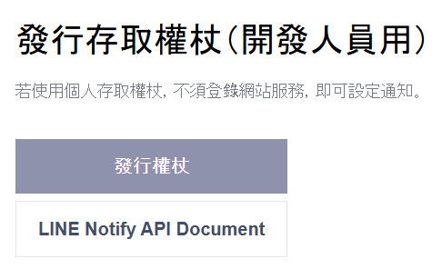
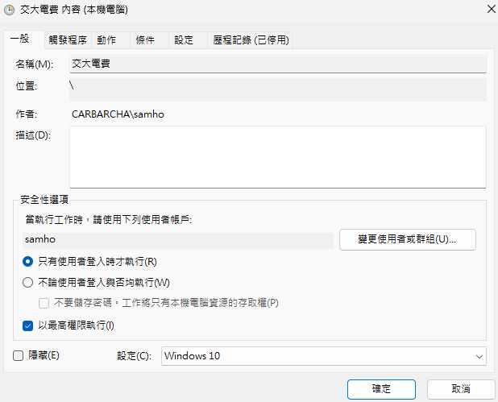
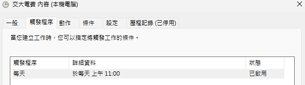
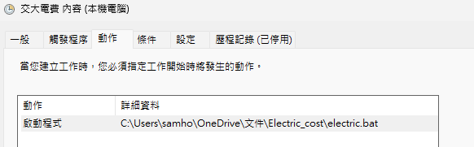

# NYCU 電錶通知小工具

## 簡介

這是一個自動化的陽明交通大學 台南校區 電錶通知小工具。透過此工具，您可以每日從 Line Notify 接收到用電情況的通知，方便了解每日的電力消耗。


## 如何使用

請按照以下步驟來啟動並使用此工具：

### 1. 建立 Line Notify 權杖

- 點擊以下連結: [Line Notify](https://notify-bot.line.me/my/)
- 使用您的 Line 帳號登入，並點擊發行權杖。
- 選擇要接收通知的聊天室，然後取得權杖的 token。



### 2. 在專案內設置 `.env` 環境變數

- 複製此專案到您的本地端：
  ```
  git clone https://github.com/nuts-has-been-taken/NYCU_ammeter.git
  ```
- 修改 `.env example` 檔案中的以下變數：
  - PHONE: 您的手機號碼
  - ROOM_NO: 您的房間號碼
  - LINE_NOTIFY_TOKEN: 您取得的 Line Notify 權杖
- 將 `.env example` 的名稱改成 `.env` 並且保存

### 3. 設定排程工作

Windows

- 在 windows 搜尋 `工作排程器` 並且打開
- 點擊 `建立工作` 在一般選項填入基本資訊
  
- 點擊 `觸發程序` 選擇自己喜好的時間
  
- 點擊 `動作` 選擇 project 內的 electric.bat
  
- `條件``設定` 依自己喜好調整
  Linux
- 使用指令叫出 crontab 文件

```
crontab -e
```

- 添加時間和 `electric.sh` 的路徑, ex. 每天早上11點執行 `electric.sh`

```
0 11 * * * /path/to/electric.sh
```

## 貢獻指南

歡迎任何形式的幫助 !
你可以透過 pull request 來提交你的更改
